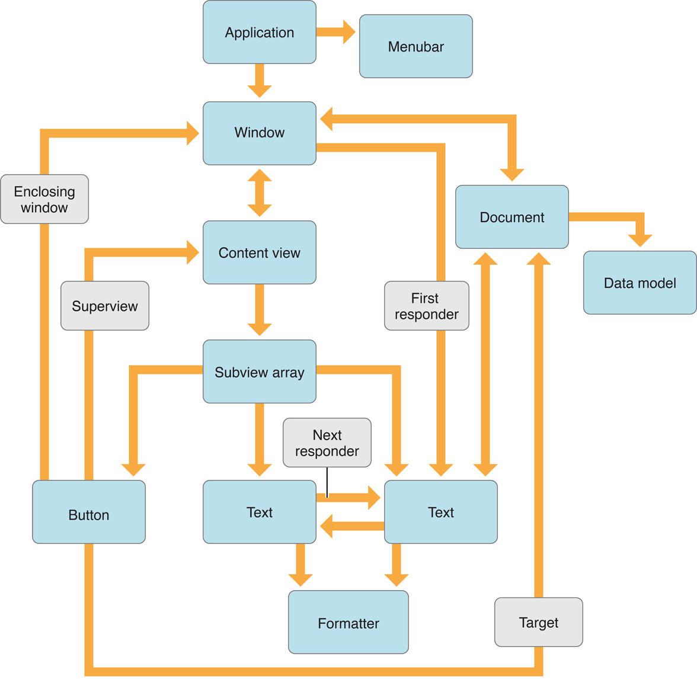

# Object Graphs 对象图

Object-oriented applications contain complex webs of interrelated objects. Objects are linked to each other by one object either owning or containing another object or holding a reference to another object to which it sends messages. This web of objects is called an object graph.

面向对象应用程序包含复杂的相互关联的对象网络。对象通过拥有或者包含另一个对象或者持有一个对其发送消息的其他对象的引用相互连接。这个对象的网络被叫做对象图。

Even with very few objects, an application’s object graph becomes very entangled with circular references and multiple links to individual objects. [Figure 1](#figure1) shows an incomplete object graph for a simple Cocoa application in OS X. (Many more connections exist than are shown in this figure.) Consider the window’s view hierarchy portion of the object graph. This hierarchy is described by each view containing a list of all of its immediate subviews. However, views also have links to each other to describe the responder chain and the keyboard focus loop. Views also link to other objects in the application for target-action messages, contextual menus, and much more.

即使只有很少的对象，应用程序的对象图也会与循环引用和多个单独对象的链接纠缠在一起。 [图1](#figure1)显示了OS X中一个简单的Cocoa应用程序的不完整的对象图。(存在的连接比此图中所示更多。)考虑对象图的window的视图层次结构部分。这个层次结构由包含所有直接子视图列表的每个视图来描述。但是，视图之间也有链接到对方来描述响应者链和键盘焦点循环。视图还链接到应用程序中的目标-动作消息，上下文菜单等等其他对象。

**Figure 1**  Partial object graph of an application

**图1** 一个应用程序的部分对象图

There are situations where you may want to convert an object graph, usually just a section of the full object graph in the application, into a form that can be saved to a file or transmitted to another process or machine and then reconstructed. Nib files and property lists are two examples in OS X where object graphs are saved to a file. Nib files are archives that represent the complex relationships within a user interface, such as a window’s view hierarchy. Property lists are serializations that store the simple hierarchical relationship of basic value objects. More details on archives and serializations, and how you can use them, are described in the following sections.

在某些情况下，你可能需要将对象图，通常只是应用程序完整对象图的一部分，转换为可以保存到文件或传输到另一个进程或机器，然后进行重建的形式。Nib文件和属性列表是OS X中将对象图保存到文件的两个示例。Nib文件是代表用户界面复杂关系的存档。例如一个window的视图层次结构。属性列表是序列化，存储基本值对象的简单层次关系。有关存档和序列化的更多详细信息以及如何使用它们，将在以下各节中介绍。

## Archives 归档

An archive can store an arbitrarily complex object graph. The archive preserves the identity of every object in the graph and all the relationships it has with all the other objects in the graph. When unarchived, the rebuilt object graph should, with few exceptions, be an exact copy of the original object graph.

归档可以存储任意复杂的对象图。存档保留图中每个对象的特性以及它与图中所有其他对象之间的所有关系。当被解档时，除了少数例外，重建的对象图应该是原始对象图的精确副本。

Your application can use an archive as the storage medium of your data model. Instead of designing (and maintaining) a special file format for your data, you can leverage Cocoa’s archiving infrastructure and store the objects directly into an archive.

您的应用程序可以使用存档作为数据模型的归档媒介。 您可以利用Cocoa的存档基础架构，将对象直接存储到存档中，而不是为你的数据设计（并维护）特殊的文件格式。

To support archiving, an object must adopt the NSCoding  protocol, which consists of two methods. One method encodes the object’s important instance variables into the archive and the other decodes and restores the instance variables from the archive.

为了支持归档，一个对象必须采用NSCoding协议，它由两个方法组成。 一个方法是将对象的重要实例变量编码到归档中，另一个将归档中的实例变量进行解码和恢复。

All of the Foundation value objects objects (NSString, NSArray, NSNumber, and so on) and most of the Application Kit and UIKit user interface objects adopt NSCoding and can be put into an archive. Each class’s reference document identifies whether they adopt NSCoding.

所有的Foundation值对象（NSString，NSArray，NSNumber等）和大部分Application Kit和UIKit用户界面对象都采用了NSCoding并可以被放入到一个存档中。每个类的参考文档标识了他们是否采用了NSCoding。

## Serializations 序列化
Serializations store a simple hierarchy of value objects, such as dictionaries, arrays, strings, and binary data. The serialization only preserves the values of the objects and their position in the hierarchy. Multiple references to the same value object might result in multiple objects when deserialized. The mutability of the objects is not maintained.

序列化存储值对象的简单层次结构，例如字典，数组，字符串和二进制数据。序列化只保存对象的值和它们在层次结构中的位置。对同一个值对象的多次引用在反序列化时可能会导致多个对象。 对象的可变性不被保持。

Property lists are examples of serializations. Application attributes (the Info.plist file) and user preferences are stored as property lists.

属性列表是序列化的一个例子。应用程序属性(Info.plist文件)和用户偏好被存储为属性列表。