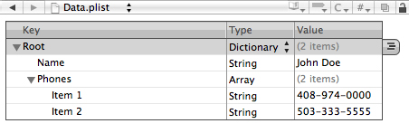
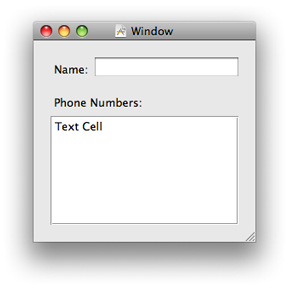

# Quick Start for Property Lists 属性列表快速入门
This mini-tutorial gives you a quick, practical introduction to property lists. You start by specifying a short property list in XML. Then you design an application that, when it launches, reads and converts the elements of the XML property list into their object equivalents and stores these objects in instance variables. The application displays these object values in the user interface and allows you to change them. When you quit the application, it writes out the modified property list as XML. When you relaunch the application, the new values are displayed.

这个小教程给你一个快速，实用的属性列表介绍。首先，在XML中指定一个简短的属性列表。 然后，设计一个应用程序，当它启动时，将XML属性列表的元素读取并转换为其对象等价物，并将这些对象存储在实例变量中。 应用程序在用户界面中显示这些对象值，并允许您更改它们。 当您退出应用程序时，它将修改后的属性列表写为XML。当您重新启动应用程序时，将显示新的值。

## Create the XML Property List 创建XML属性列表
In Xcode, create a simple Cocoa application project—call it PropertyListExample. Then select the Resources folder of the project and choose New File from the File menu. In the “Other” template category, select the Property List template and click Next. Name the file “Data.plist”.

在Xcode中，创建一个简单的Cocoa应用程序项目 - 称之为PropertyListExample。 然后选择项目的资源文件夹，然后从文件菜单中选择新建文件。 在“其他”模板类别中，选择“属性列表”模板，然后单击“下一步”。命名文件为“Data.plist”。

Double-click the `Data.plist` file in Xcode (you’ll find it in the Resources folder). Xcode displays an empty property list in a special editor. Edit the property list so that it looks like the following example:

双击在Xcode中（您可以在Resources文件夹中找到它）的`Data.plist`文件。 Xcode在特殊的编辑器中显示一个空的属性列表。编辑属性列表，使其看起来像下面的示例：



You can also edit the property list in a text editor such as TextEdit or BBEdit. When you’re finished, it should look like the following XML code.

您还可以在文本编辑器（如TextEdit或BBEdit）中编辑属性列表。 当你完成后，它应该看起来像下面的XML代码。

```xml
<?xml version="1.0" encoding="UTF-8"?>
<!DOCTYPE plist PUBLIC "-//Apple//DTD PLIST 1.0//EN" "http://www.apple.com/DTDs/PropertyList-1.0.dtd">
<plist version="1.0">
<dict>
    <key>Name</key>
    <string>John Doe</string>
    <key>Phones</key>
    <array>
        <string>408-974-0000</string>
        <string>503-333-5555</string>
    </array>
</dict>
</plist>
```

Because the property-list file is in the Resources folder, it will be written to the application’s main bundle when you build the project.

因为属性列表文件位于Resources文件夹中，所以当您构建项目时，它将被写入到应用程序的main bundle中。

## Define Storage for the Property-List Objects 为属性列表对象定义存储

In this step, you’ll add a coordinating controller class to the project and declare properties to hold the property-list objects defined in `Data.plist`. (Note the distinction here between declared *property* and *property-list* object.)

在这一步中，您将为项目添加一个协调控制器类，并声明属性来持有定义在`Data.plist`中的属性列表对象。（注意此处的声明*属性*和*属性列表*对象之间的区别。）

In Xcode, select the Classes folder and choose New File from the File menu. Select the Objective-C Class template and name the files “Controller.h” and “Controller.m”. Make the following declarations in `Controller.h`.

在Xcode中，选择Classes文件夹，然后从File菜单中选择New File。 选择Objective-C类模板并命名文件为“Controller.h”和“Controller.m”。 在`Controller.h`中进行以下声明。

```objc
#import <Cocoa/Cocoa.h>
 
@interface Controller : NSObject {
    NSString *personName;
    NSMutableArray *phoneNumbers;
}
 
@property (copy, nonatomic) NSString *personName;
@property (retain, nonatomic) NSMutableArray *phoneNumbers;
 
@end
```

In `Controller.m`, have the compiler synthesize accessor methods for these properties:

在`Controller.m`中，让编译器为这些属性合成访问器方法：

```objc
@implementation Controller
 
@synthesize personName;
@synthesize phoneNumbers;
 
@end

```

## Create the User Interface 创建用户界面

Double-click the project’s nib file to open it in Interface Builder. Create a simple user interface similar to the following:

双击工程的nib文件以在Interface Builder中打开它。创建一个类似于下面的简单用户界面：


> **Note:** This mini-tutorial shows user-interface techniques and programming interfaces that are specific to OS X. If you want to use an iOS application for this example, you must use techniques and API that are appropriate to that platform. The code specific to property lists is applicable to both platforms.
> **注意：** 这个迷你教程展示了特定于OS X的用户界面技术和编程接口。如果您想在本例中使用iOS应用程序，则必须使用适合该平台的技术和API。特定于属性列表的代码适用于这两个平台。

The table view should have a single column that is editable.

表格视图应该有一个可编辑的列。

For reasons of simplicity and efficiency, you’ll next bind the text field to the `personName` property. But your Controller object will act as a data source for the table. Let’s start with the text field.

为了简单和高效的原因，接下来将文本字段绑定到`personName`属性。 但是你的Controller对象将作为表格的数据源。让我们从文本字段开始。

1. Drag an generic Object proxy from the Library into the nib document window. Select it and, in the Identify pane of the inspector, type or select “Controller” for its class identity.
	
	将通用对象代理从库中拖到nib文档窗口中。选择它，然后在检查器的Identify窗格中键入或选择“Controller”作为其类标识。
2. Drag an Object Controller object from the Library into the nib document window. Control-drag (or right-click-drag) a line from Object Controller to Controller and, in the connection window that pops up, select “content”.

	将库中的对象控制器对象拖到nib文档窗口中。从Object Controller到Controller按住拖动（或右击拖动）一条线，并且在弹出的连接窗口中选择“content”。
3. Select the editable text field and, in the Bindings pane of the inspector, bind the value attribute of the text field according to the following:
    * Bind to: Object Controller 	
    * Controller Key: selection
    * Model Key Path: personName

	选择可编辑的文本字段，然后在检查器的Bindings窗格中，根据以下内容绑定文本字段的值属性：
    
    * 	绑定到：Object Controller
    *  控制器键：selection
    *  模型键路径：personName

Next, Control-drag a line from File’s Owner in the nib document window (File’s Owner in this case represents the global [NSApplication](https://developer.apple.com/documentation/appkit/nsapplication) object) to the Controller object and then select `delegate` in the connection window. As you’ll see, the application delegate (Controller) plays a role in saving the property list to its XML representation.

接下来，控制拖动一条从在nib文档窗口中的文件所有者(在这种情况下文件所有者代表全局的[NSApplication](https://developer.apple.com/documentation/appkit/nsapplication)对象)到控制器对象的线，并且在连接窗口中选择`delegate`。 如您所见，应用程序代理（Controller）在将属性列表保存为其XML表示形式方面发挥着作用。

For the table view, Control-drag a line from the table view to the Controller object in the nib document window. Select the `dataSource` outlet in the connection window. Save the nib file. Copy the code in Listing 1-1 to `Controller.m`.

对于表格视图，在nib文档窗口中控制拖动一条从表视图到Controller对象的线。在连接窗口中选择`dataSource`出口(outlet)。 保存该nib文件。 将在清单1-1中的代码复制到`Controller.m`中。

**Listing 1-1**  Implementation code for table view’s data source

**清单1-1** 表视图数据源的实现代码

```objc
 - (NSInteger)numberOfRowsInTableView:(NSTableView *)tableView {
    return self.phoneNumbers.count;
}
 
 - (id)tableView:(NSTableView *)tableView
         objectValueForTableColumn:(NSTableColumn *)tableColumn
         row:(NSInteger)row {
    return [phoneNumbers objectAtIndex:row];
}
 
- (void)tableView:(NSTableView *)tableView setObjectValue:(id)object
         forTableColumn:(NSTableColumn *)tableColumn row:(NSInteger)row {
    [phoneNumbers replaceObjectsAtIndexes:[NSIndexSet indexSetWithIndex:row]
                  withObjects:[NSArray arrayWithObject:object]];
}
```

Note that the last method synchronizes changes to items in the table view with the `phoneNumbers` mutable array that backs it.

请注意，最后一个方法使用支持它的`phoneNumbers`可变数组来同步对表视图中项目的更改。

## <a name="ReadinthePropertyList"></a> Read in the Property List 读取属性列表

Now that the necessary user-interface tasks are completed, we can focus on code that is specific to property lists. In its `init` method, the Controller object reads in the initial XML property list from the main bundle when the application is first launched; thereafter, it gets the property list from the user’s `Documents` directory. Once it has the property list, it converts its elements into the corresponding property-list objects. Listing 1-2 shows how it does this.

现在完成了必要的用户界面任务，我们可以专注于特定于属性列表的代码。 在它的`init`方法中，当应用程序首次启动时Controller对象从main bundle中读取初始XML属性列表; 此后，它从用户的`Documents`目录中获取属性列表。一旦它具有属性列表，它将其元素转换为相应的属性列表对象。清单1-2展示了它是怎样做的。

**Listing 1-2** Reading in and converting the XML property list

**清单1-2** 读入和转换XML属性列表

```objc
- (id) init {
 
    self = [super init];
    if (self) {
        NSString *errorDesc = nil;
        NSPropertyListFormat format;
        NSString *plistPath;
        NSString *rootPath = [NSSearchPathForDirectoriesInDomains(NSDocumentDirectory,
           NSUserDomainMask, YES) objectAtIndex:0];
        plistPath = [rootPath stringByAppendingPathComponent:@"Data.plist"];
        if (![[NSFileManager defaultManager] fileExistsAtPath:plistPath]) {
            plistPath = [[NSBundle mainBundle] pathForResource:@"Data" ofType:@"plist"];
        }
        NSData *plistXML = [[NSFileManager defaultManager] contentsAtPath:plistPath];
        NSDictionary *temp = (NSDictionary *)[NSPropertyListSerialization
            propertyListFromData:plistXML
            mutabilityOption:NSPropertyListMutableContainersAndLeaves
            format:&format
            errorDescription:&errorDesc];
        if (!temp) {
            NSLog(@"Error reading plist: %@, format: %d", errorDesc, format);
        }
        self.personName = [temp objectForKey:@"Name"];
        self.phoneNumbers = [NSMutableArray arrayWithArray:[temp objectForKey:@"Phones"]];
 
    }
    return self;
}
```

This code first gets the file-system path to the file containing the XML property list (`Data.plist`) in the `~/Documents` directory. If there is no file by that name at that location, it obtains the property-list file from the application’s main bundle. Then it uses the `NSFileManager` method [contentsAtPath:](https://developer.apple.com/documentation/foundation/nsfilemanager/1407347-contentsatpath) to read the property list into memory as an [NSData](https://developer.apple.com/documentation/foundation/nsdata) object. After that, it calls the `NSPropertyListSerialization` class method [propertyListFromData:mutabilityOption:format:errorDescription:](https://developer.apple.com/documentation/foundation/nspropertylistserialization/1411993-propertylistfromdata?language=objc) to convert the static property list into the corresponding property-list objects—specifically, a dictionary containing a string and an array of strings. It assigns the string and the array of strings to the appropriate properties of the Controller object.

此代码首先在`~/Documents`目录中获取到文件系统路径到包含XML属性列表（`Data.plist`）的文件。如果在该位置没有该名称的文件，则从应用程序的main bundle中获取属性列表文件。 然后它使用`NSFileManager`的[contentsAtPath:](https://developer.apple.com/documentation/foundation/nsfilemanager/1407347-contentsatpath)方法将属性列表作为[NSData](https://developer.apple.com/documentation/foundation/nsdata)对象读入内存。 之后，它调用`NSPropertyListSerialization`类方法[propertyListFromData:mutabilityOption:format:errorDescription:](https://developer.apple.com/documentation/foundation/nspropertylistserialization/1411993-propertylistfromdata?language=objc)将静态属性列表转换为相应的属性列表对象 - 具体来说，是一个包含字符串和字符串数组的字典。它将字符串和字符串数组分配给Controller对象的适当的属性。

## <a name="WriteOutthePropertyList"></a>Write Out the Property List 写出属性列表

When the user quits the application, you want to save the current values of the `personName` and `phoneNumbers` properties in a dictionary object, convert those property-list objects to a static XML representation, and then write that XML data to a file in `~/Documents`. The [applicationShouldTerminate:](https://developer.apple.com/documentation/appkit/nsapplicationdelegate/1428642-applicationshouldterminate?language=objc) delegate method of `NSApplication` is the appropriate place to write the code shown in Listing 1-3.

当用户退出应用程序时，你想将`personName`和`phoneNumbers`属性的当前值保存到一个字典对象中，将这些属性列表对象转换为静态XML表示形式，然后将该XML数据写入在`~/Documents`中的一个文件。`NSApplication`的代理方法 [applicationShouldTerminate:](https://developer.apple.com/documentation/appkit/nsapplicationdelegate/1428642-applicationshouldterminate?language=objc)是编写清单1-3所示代码的合适位置。

**Listing 1-3**  Converting and writing the property list to the application bundle

**清单1-3** 将属性列表转换并写入应用程序bundle

```objc
- (NSApplicationTerminateReply)applicationShouldTerminate:(NSApplication *)sender {
    NSString *error;
    NSString *rootPath = [NSSearchPathForDirectoriesInDomains(NSDocumentDirectory, NSUserDomainMask, YES) objectAtIndex:0];
    NSString *plistPath = [rootPath stringByAppendingPathComponent:@"Data.plist"];
    NSDictionary *plistDict = [NSDictionary dictionaryWithObjects:
            [NSArray arrayWithObjects: personName, phoneNumbers, nil]
            forKeys:[NSArray arrayWithObjects: @"Name", @"Phones", nil]];
    NSData *plistData = [NSPropertyListSerialization dataFromPropertyList:plistDict
                            format:NSPropertyListXMLFormat_v1_0
                            errorDescription:&error];
    if(plistData) {
        [plistData writeToFile:plistPath atomically:YES];
    }
    else {
        NSLog(error);
        [error release];
    }
    return NSTerminateNow;
}
```

This code creates an [NSDictionary](https://developer.apple.com/documentation/foundation/nsdictionary) object containing the values of the `personName` and `phoneNumbers` properties and associates these with the keys “Name” and “Phones”. Then, using the [dataFromPropertyList:format:errorDescription:](https://developer.apple.com/documentation/foundation/nspropertylistserialization/1416061-datafrompropertylist) class method of [NSPropertyListSerialization](https://developer.apple.com/documentation/foundation/propertylistserialization), it converts this top-level dictionary and the other property-list objects it contains into XML data. Finally, it writes the XML data to `Data.plist` in the user’s `Documents` directory.

此代码创建一个包含`personName`和`phoneNumbers`属性值的 [NSDictionary](https://developer.apple.com/documentation/foundation/nsdictionary)对象，并将这些值与“Name”和“Phones”键相关联。 然后，使用`NSPropertyListSerialization`的[dataFromPropertyList:format:errorDescription:](https://developer.apple.com/documentation/foundation/nspropertylistserialization/1416061-datafrompropertylist)类方法，将该顶级字典及其所包含的其他属性列表对象转换为XML数据。 最后，它将XML数据写入用户的`Documents`目录中的`Data.plist`。

## Run and Test the Application 运行并测试应用程序

Build and run the application. The window appears with the name and phone numbers you specified in the XML property list. Modify the name and a phone number and quit the application. Find the `Data.plist` file in `~/Documents` and open it in a text editor. You’ll see that the changes you made in the user interface are reflected in the XML property list. If you launch the application again, it displays the changed values.

构建并运行应用程序。 该窗口将显示您在XML属性列表中指定的名称和电话号码。 修改名称和电话号码并退出应用程序。 在`~/Documents`中找到`Data.plist`文件，并在文本编辑器中打开它。您将看到您在用户界面中所做的更改反映在XML属性列表中。如果再次启动应用程序，它将显示更改的值。