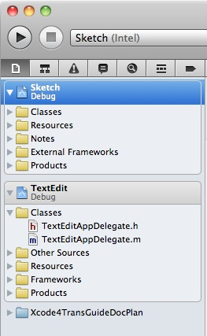

## Xcode Workspace

A workspace is an Xcode document that groups projects and other documents so you can work on them together. A workspace can contain any number of Xcode projects, plus any other files you want to include. In addition to organizing all the files in each Xcode project, a workspace provides implicit and explicit relationships among the included projects and their targets.

一个`workspace`是将工程和其他文档分组的一个Xcode文档，这样子您可以一起处理他们。一个`workspace`可以包含任意数量的Xcode工程，以及你想要包含的任何其他文件。除了组织在每个Xcode工程中的所有文件之外，一个`workspace`提供了在被包含的工程中和他们的`targets`之间的隐式的和显式的依赖关系。

#### Workspaces Extend the Scope of Your Workflow
#### 工作区扩展你的工作流程的范围

A project file contains pointers to all the files in the project, along with build configurations and other project information. In Xcode 3 and earlier, the project file is always the root of the group and file structure hierarchy. Although a project can contain references to other projects, working on interrelated projects in Xcode 3 is complicated; most workflows are confined to a single project. In Xcode 4 and later, you have the option of creating a workspace to hold one or more projects, plus any other files you wish to include.

一个工程文件包含指向工程里所有文件的指针，以及构建配置和其他工程信息。在Xcode3以及更早的版本，工程文件始终是组和文件结构层次的根节点。尽管一个工程可以包含对其他工程的引用，但在Xcode3中处理相关工程是很复杂的。大多数工作流仅限于单个项目。在Xcode4和更高版本中，您可以选择创建一个`workspace`来持有一个或多个工程，以及你希望包含的任何其他文件。

In addition to providing access to all the files in each included Xcode project, a workspace extends the scope for many important Xcode workflows. For example, because indexing is done across the whole workspace, code completion, Jump to Definition, and all other content-aware features work seamlessly through all projects in the workspace. Because refactoring operations act across all the content of the workspace, you can refactor the API in a framework project and in several application projects that use that framework all in one operation. When building, one project can make use of the products of other projects in the workspace.

除了提供对每个包含的Xcode工程中所有文件的访问之外，一个`workspace`还扩展了许多重要的Xcode工作流的范围。例如，由于索引是在整个`workspace`中完成的，因此，自动代码完成，跳转到定义和所有其他内容感知功能都可以在`workspace`中的所有工程无缝运行。因为重构操作作用于`workspace`的所有内容，所以您可以在一个框架项目中以及在一个使用该框架的多个应用程序工程中重构API。在构建时，一个工程可以使用`workspace`内其他工程的产品。

The workspace document contains pointers to the included projects and other files, but no other data. A project can belong to more than one workspace. The figure shows a workspace containing two Xcode projects (Sketch and TextEdit) plus a documentation project (Xcode4TransGuideDocPlan).

`workspace`文档包含指向所包含工程和其他文件的指针，但没有其他数据。一个工程可以属于多个`workspace`。下图显示了一个`workspace`，其中包含了两个xcode工程(`Sketch`和`TextEdit`)，以及一个文档工程(`Xcode4TransGuideDocPlan`)。

#### Projects in a Workspace Share a Build Directory(工作空间中的工程共享构建目录)

By default, all the Xcode projects in a workspace are built in the same directory, referred to as the workspace build directory. Each workspace has its own build directory. Because all of the files in all of the projects in a workspace are in the same build directory, all of these files are visible to each project. Therefore, if two or more projects use the same libraries, you don’t need to copy them into each project folder separately.

默认情况下，`workspace`中的所有Xcode工程都构建在同一个目录中，成为`workspace`构建目录。每个`workspace`有其自己的构建目录。因为`workspace`中所有工程的所有文件都在用一个构建目录中，所以这些文件对每个工程都是可见的。因此，如果两个或多个工程使用相同的库，您无需分别复制他们到每个工程的文件夹中。

Xcode examines the files in the build directory to discover implicit dependencies. For example, if one project included in a workspace builds a library that is linked against by another project in the same workspace, Xcode automatically builds the library before building the other project, even if the build configuration does not make this dependency explicit. You can override such implicit dependencies with explicit build settings if necessary. For explicit dependencies, you must create project references.

Xcode检查在构建目录中的文件以发现隐式依赖。例如，如果一个`workspace`里的工程构建了被`workspace`中另一个工程链接的库，Xcode则会在构建另一个工程之前自动构建这个库，即使构建配置没有明确显式做这个依赖。如有需要的话， 您可以使用显式构建设置来覆盖此类隐式依赖。对于显式依赖，你必须创建工程引用。

Each project in a workspace continues to have its own independent identity. To work on a project without affecting—or being affected by—the other projects in the workspace, you can open the project without opening the workspace, or you can add the project to another workspace. Because a project can belong to more than one workspace, you can work on your projects in any number of combinations without having to reconfigure any of the projects or workspaces.

在`workspace`里的每个工程都将继续拥有自己独立的身份。要在不影响或不被在`workspace`里其他工程影响的情况下处理工程，你可以在不打开`workspace`的情况下打开工程，或者你可以把该工程添加到另一个`workspace`。由于一个工程可以属于多个`workspace`，你可以以多种组合方式来在工程上工作，而不必重新配置任何工程或`workspace`。

You can use the workspace’s default build directory or you can specify one. Note that if a project specifies a build directory, that directory is overridden by the build directory of whatever workspace the project is in at the time you build the project.

你可以使用`workspace`的默认构建目录，或者你可以指定一个。注意，如果一个工程指定了一个构建目录，那么在构建工程时，该目录将被该工程所在的任何`workspace`的构建目录覆盖。
#### 相关文章
[Projects](Xcode%20Project.md)

[Targets](Xcode%20Target.md)

[Build Settings](Build%20Settings.md)